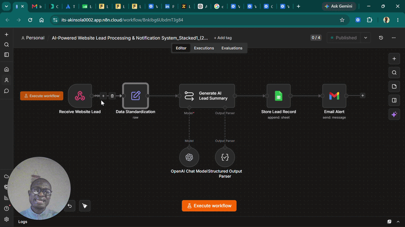

# AI Lead Capture Automation

An AI-powered lead capture and qualification workflow that automatically collects leads, evaluates them using AI, stores structured information, and alerts the sales team in real time.

## Business Problem

Businesses receive inquiries from websites throughout the day. Manually reviewing each submission delays follow-up, causes missed opportunities, and makes it difficult to prioritize high-quality leads.

## Solution

This workflow automates the entire lead management process by collecting customer information from an online form, using AI to analyze the submission, organizing the data, notifying the sales team, and sending an acknowledgment email to the prospect.

## Workflow

1. Customer submits the online form.
2. n8n receives the submission.
3. AI reviews and summarizes the lead.
4. Lead information is stored in Airtable.
5. Slack notification is sent to the sales team.
6. A personalized acknowledgment email is sent automatically.

## Features

- Automated lead capture
- AI-powered lead qualification
- Structured data storage
- Slack notifications
- Automatic email acknowledgment
- Airtable integration
- No manual data entry

## Technologies Used

- n8n
- OpenAI
- Fillout Forms
- Airtable
- Gmail
- Slack
- Webhooks

## Architecture

